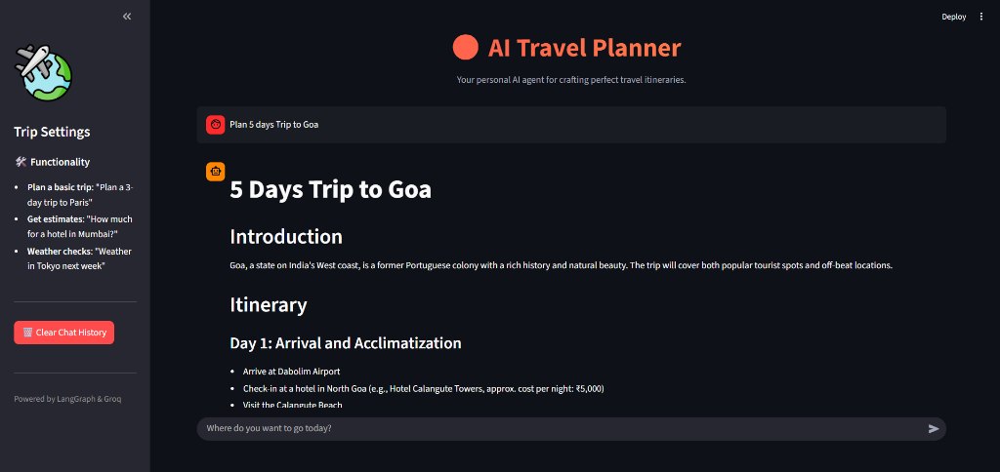

# Agentic AI Trip Planner

An AI-powered trip planning application that helps users generate detailed travel itineraries. It leverages LangChain, LangGraph, and various APIs to provide personalized travel recommendations.

## Features

- **Personalized Itineraries**: Generates day-by-day travel plans based on user input.
- **Weather Integration**: Fetches real-time and forecast weather data using OpenWeatherMap.
- **Place Search**: Finds attractions, restaurants, and activities using Google Places and Tavily.
- **Expense Estimation**: Calculates estimated costs for hotels, food, and activities.
- **Currency Conversion**: Converts currencies using real-time exchange rates via ExchangeRate-API.
- **Interactive UI**: User-friendly Streamlit interface for easy interaction.
- **PDF Export**: Automatically saves generated trip plans as professionally formatted PDF files.

## UI Screenshot


## Prerequisites

- Python 3.9+
- API Keys for:
    - **Groq** (LLM Provider)
    - **OpenAI** (Optional, if configured)
    - **Google Places API**
    - **Tavily API**
    - **OpenWeatherMap API**
    - **Exchange Rate API** (e.g., ExchangeRate-API)

## Installation

1.  **Clone the repository:**

    ```bash
    git clone <repository_url>
    cd AI_Trip_Planner
    ```

2.  **Create and activate a virtual environment:**

    ```bash
    python -m venv env
    # Windows
    .\env\Scripts\activate
    # macOS/Linux
    source env/bin/activate
    ```

3.  **Install dependencies:**

    ```bash
    pip install -r requirement.txt
    ```

4.  **Set up Environment Variables:**

    Create a `.env` file in the root directory and add your API keys:

    ```env
    OPENAI_API_KEY="your_openai_api_key"
    GROQ_API_KEY="your_groq_api_key"
    GOOGLE_API_KEY="your_google_api_key"
    GPLACES_API_KEY="your_google_places_api_key"
    FOURSQUARE_API_KEY="your_foursquare_api_key"
    TAVILY_API_KEY="your_tavily_api_key"
    OPENWEATHERMAP_API_KEY="your_openweathermap_api_key"
    EXCHANGE_RATE_API_KEY="your_exchange_rate_api_key"
    ```

## Usage

1.  **Start the Backend API (FastAPI):**

    ```bash
    uvicorn main:app --reload --port 8000
    ```

    The API will be available at `http://localhost:8000`.

2.  **Start the Frontend (Streamlit):**

    Open a new terminal, activate the environment, and run:

    ```bash
    streamlit run streamlit_app.py
    ```

    The application will open in your browser at `http://localhost:8501`.

3.  **Plan a Trip:**
    - Enter your trip details in the input box (e.g., "Plan a 5-day trip to Goa").
    - The AI agent will process your request, gathering weather, place, and cost information to generate a comprehensive plan.

## Project Structure

- `agent/`: Contains the LangGraph workflow logic.
- `tools/`: encapsulations of external APIs (Weather, Places, Calculator, etc.).
- `utils/`: Helper functions for APIs and calculations.
- `logger/`: Logging configuration.
- `exception/`: Custom exception handling.
- `config/`: Configuration files (e.g., `config.yaml`).
- `main.py`: FastAPI backend entry point.
- `streamlit_app.py`: Streamlit frontend.

## Logs

Application logs are stored in the `logs/` directory. Check them for debugging information and execution details.

## Output

Generated trip plans are automatically saved as PDF files in the `output/` directory. Each file is timestamped, e.g., `AI_Trip_Planner_2026-01-14_14-00-00.pdf`.
