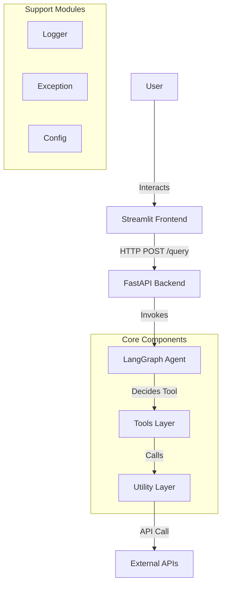

# Agentic AI Trip Planner - Project Architecture & Beginner's Guide

This document provides a comprehensive overview of the AI Trip Planner project, explaining the purpose of each folder, how the code connects, and the overall architectural flow.

## 1. High-Level Architecture

The application follows a **Microservices-style** architecture (even though it's currently a monolith) with a clear separation between the **Frontend**, **Backend API**, and the **AI Agent Logic**.

## 2. Folder Structure & Usage

Here is a breakdown of what each folder does:

### 📂 `agent/`
*   **Purpose**: Contains the "Brain" of the application.
*   **Key File**: `agentic_workflow.py`
    *   Defines the **LangGraph** workflow.
    *   It decides *what* to do next (e.g., "Should I search for a hotel?", "Should I check the weather?", or "Do I have enough info to answer?").
*   **Connections**: Imports tools from `tools/` to execute actions.

### 📂 `tools/`
*   **Purpose**: The "Hands" of the agent. These are wrappers that make external functions usable by the AI.
*   **Files**: `weather_info_tool.py`, `place_search_tool.py`, `expense_calculator_tool.py`, etc.
*   **Structure**: Each tool file defines a class (e.g., `WeatherInfoTool`) that registers specific functions using the `@tool` decorator.
*   **Connections**:
    *   **In**: Used by `agent/` to perform tasks.
    *   **Out**: Calls functions in `utils/` to doing the actual heavy lifting.

### 📂 `utils/`
*   **Purpose**: The "Workers". Pure Python functions that perform specific computations or API calls. They don't know about "AI" or "Agents"; they just do a job.
*   **Files**: `weather_info.py` (calls OpenWeatherMap), `expense_calculator.py` (math logic), `currency_converter.py`, etc.
*   **Connections**: Imported by `tools/`.

### 📂 `logger/`
*   **Purpose**: Centralized logging system.
*   **File**: `logging.py`
*   **Usage**: Used by **every** file in the project to record what is happening (`logger.info(...)`) or if something goes wrong (`logger.error(...)`).

### 📂 `exception/`
*   **Purpose**: Custom error handling.
*   **File**: `exception.py`
*   **Usage**: Defines `TripPlannerException`. Instead of crashing with a generic Python error, we wrap errors in this custom class to provides better context (file name, line number).

### 📂 `config/`
*   **Purpose**: Configuration management.
*   **File**: `config.yaml`
*   **Usage**: Stores settings like model names (e.g., `llama-3.3-70b-versatile`) so you don't safeguard them in the code.

### 📄 `main.py`
*   **Purpose**: The **Backend Server**.
*   **Technology**: FastAPI.
*   **Role**:
    1.  Receives requests from the Frontend.
    2.  Initializes the Agent.
    3.  Runs the Agent.
    4.  Returns the final answer to the Frontend.
*   **Connections**: Connects the `Frontend` to the `Agent`.

### 📄 `streamlit_app.py`
*   **Purpose**: The **User Interface**.
*   **Technology**: Streamlit.
*   **Role**: Displays the chat window, takes user input, sends it to `main.py`, and shows the result.

## 3. The Flow of a Request

Let's trace what happens when a user asks: *"Plan a trip to Goa."*

1.  **Frontend (`streamlit_app.py`)**:
    *   User types "Plan a trip to Goa".
    *   Streamlit sends a `POST` request to `http://localhost:8000/query` with the payload `{"question": "Plan a trip to Goa"}`.

2.  **Backend (`main.py`)**:
    *   Receives the request.
    *   Logs "Received query request...".
    *   Instantiates the `GraphBuilder` (the Agent).
    *   Calls `react_app.invoke(messages)`.

3.  **Agent (`agent/`)**:
    *   The LLM (Large Language Model) analyzes the request.
    *   **Think**: "I need to know about Goa's places and weather."
    *   **Action**: Calls `PlaceSearchTool`.

4.  **Tools (`tools/`)**:
    *   `PlaceSearchTool` receives "Goa".
    *   It calls `utils.place_info_search.GooglePlaceSearchTool`.

5.  **Utils (`utils/`)**:
    *   Makes the actual HTTP calls to Google/Tavily APIs.
    *   Returns raw data (e.g., list of beaches, hotels) to the Tool.

6.  **Agent (again)**:
    *   Receives the data.
    *   **Think**: "Okay, now I need the weather."
    *   **Action**: Calls `WeatherInfoTool`.
    *   (Repeat process for Utils).

7.  **Agent (Finalizing)**:
    *   gathers all info (Places + Weather + Costs).
    *   Generates the final itinerary text.
    *   Returns it to `main.py`.

8.  **Backend (`main.py`)**:
    *   Sends the JSON response `{"answer": "Here is your 5-day trip to Goa..."}` back to Streamlit.

9.  **Frontend (`streamlit_app.py`)**:
    *   Displays the plan in a nice chat bubble.

## 4. How to Read the Code (Beginner Tips)

*   **Start at the edges**: API calls (`utils/`) or UI (`streamlit_app.py`). These are easiest to understand.
*   **Follow the imports**: If you see `from tools.weather_info_tool import WeatherInfoTool` in `agentic_workflow.py`, go open `tools/weather_info_tool.py` to see what it does.
*   **Check the logs**: The `logs/` folder is your best friend. It shows you exactly the path the code took during execution.
